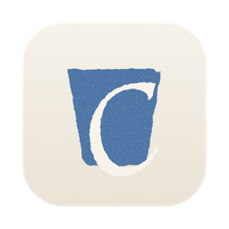

<p align="center"></p>

# Cove

A native macOS harbor for command-line coding agents.

Cove 在原版 `claude`（以及 `codex`、`agy`）外面套一层 Mac 原生外壳：终端里跑的始终是官方 CLI，外壳只补 CLI 做不好的部分。

- **会话侧栏**：读取 `~/.claude/projects`，按项目文件夹归类；⌥⌘N 一键开临时会话，单独归在「临时」。
- **原生输入框**：鼠标定位、选区、撤销、中文输入法都正常；输入框为空时 ↑↓ esc tab 交给 CLI 的菜单。
- **Agent 状态**：工具栏里实时显示它在干什么、任务进度、增删行数；检查器列出任务与改动文件，点开看 diff。
- **用量**：右下角圆环显示 5 小时 / 7 天额度与上下文占用，以及当前模型。
- **小螃蟹**：跟着 Agent 状态变动作的 Clawd，附带工作时长、token 与按 API 价格估算的花费。
- **多 CLI**：输入框里切换 Claude Code / Codex / Antigravity。

## 构建

```bash
scripts/test.sh                              # 单测
scripts/bundle.sh && open build/Cove.app     # 打包运行
scripts/make_icon.sh                         # 由 Resources/AppIcon.svg 生成图标
```

首次运行请在「系统设置 → 隐私与安全性 → 完整磁盘取用」里允许 Cove，否则位于桌面、文稿里的项目无法启动会话。

路线见 [docs/ROADMAP.md](docs/ROADMAP.md)。
